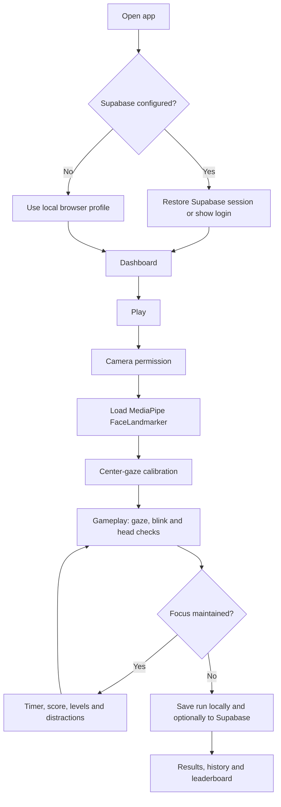

# Kannum Kannum 

## Basic Details

### Team Name: [Nisaa]

### Team Members

- Team Lead: [Neehara Anna Bince] - [Model Engineering College Thrikakkara]
- Member 2: [Sabarinadh V S] - [Model Engineering College Thrikakkara]

### Project Description

Kannum Kannum is a browser-based gaze endurance game: stare at the center eye, resist distractions, and survive as long as possible. It uses the webcam and MediaPipe face landmarks locally in the browser to detect blinks, gaze changes, head movement, and lost face tracking.

Players can create profiles, unlock different eye styles, save local records, and optionally use Supabase for accounts and a shared leaderboard.

### The Problem (that doesn't exist)

People can look away from things whenever they want. There was no suitably dramatic way to measure a person's commitment to maintaining eye contact with a suspicious cartoon eye.

### The Solution (that nobody asked for)

We built a gloriously unnecessary staring contest. The computer watches your eyes while random distractions and a late-game jump-scare attempt to ruin your focus. Blink, glance away, or move your head too much, and the eye wins.

## Technical Details

### Technologies/Components Used

For Software:

- Languages: HTML5, CSS3, JavaScript (ES modules), SQL
- Frameworks: None; this is a lightweight browser application
- Libraries: MediaPipe Tasks Vision FaceLandmarker, Supabase JavaScript client
- Tools: Browser WebRTC/getUserMedia API, Web Audio API, localStorage, Supabase, jsDelivr CDN

For Hardware:

- A laptop or desktop webcam/front camera
- A modern browser with camera permission enabled
- No external circuit or microcontroller hardware is required

### Implementation

For Software:

#### Installation

```bash
git clone <your-repository-url>
cd Kannum-Kannum
npx serve .
```

Optional shared-account and leaderboard setup:

1. Create a Supabase project.
2. Run `supabase-schema.sql` in the Supabase SQL Editor.
3. Enable the Email provider in Supabase Auth.
4. Add the project URL and anon key to `supabase-config.js`.

Never put a Supabase service-role key in the frontend.

#### Run

Open the localhost URL printed by `npx serve .` (for example `http://localhost:3000`). Allow camera access, create or sign into a profile, select **PLAY**, and complete calibration.

> Use localhost or HTTPS. Opening `index.html` directly can prevent camera and Supabase Auth features from working correctly.

### Project Documentation

For Software:

#### Screenshots (Add at least 3)


*Add a screenshot showing the player dashboard and navigation.*


*Add a screenshot showing the camera preview, center target, timer, score, and gaze meter during a round.*


*Add a screenshot showing game results, saved history, or the leaderboard.*

#### Diagrams



*The app keeps webcam processing in the browser. Only profile and score data are optionally synchronized through Supabase.*

For Hardware:

#### Schematic & Circuit

Not applicable. Kannum Kannum uses the device's built-in webcam and does not require a circuit.

#### Build Photos

Not applicable. This is a browser-only software project.

### Project Demo

#### Video

[Add your demo video link here]

*The demo should show login, calibration, a gameplay round, a distraction/jump-scare, game-over results, and the leaderboard.*

#### Additional Demos

- [Add deployed project link here]
- [Add GitHub repository link here]

## Team Contributions

- [Name 1]: [Specific contributions]
- [Name 2]: [Specific contributions]
- [Name 3]: [Specific contributions]

---

Made with ❤️ at TinkerHub Useless Projects

[](https://www.tinkerhub.org/)
[](https://tinkerhub.org/events/1M8ORET9A1/useless-projects-3.0)
